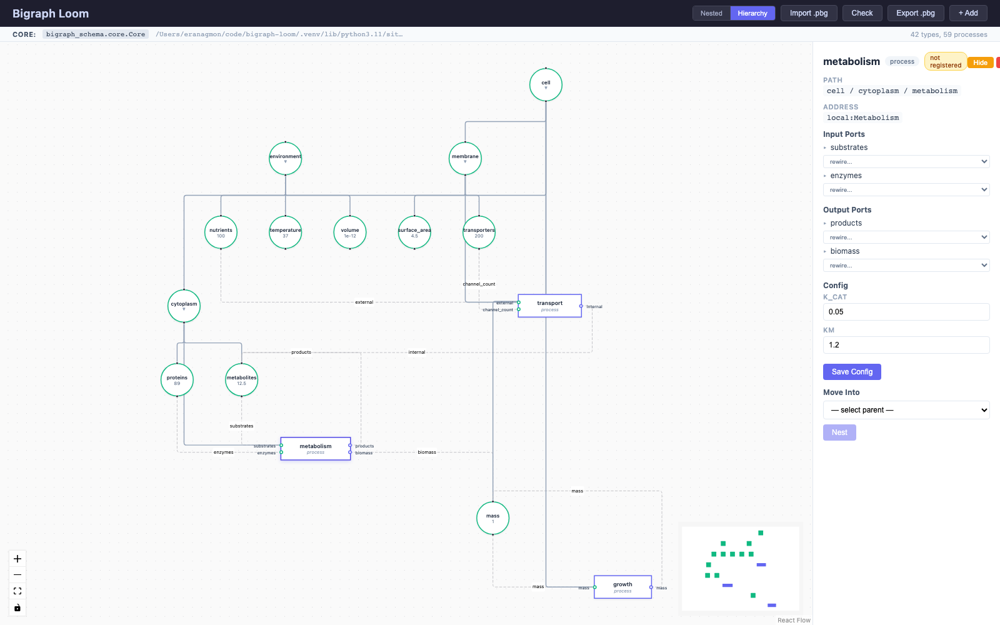

# Bigraph Loom

Interactive visual editor for [process-bigraphs](https://github.com/vivarium-collective/process-bigraph). Provides a web-based interface for exploring, editing, and composing bigraph models — with full integration into the process-bigraph type system.



## Features

- **Visualize** process-bigraphs with stores (circles), processes (rectangles), and wires (edges)
- **Two view modes**: nested (stores inside stores) and hierarchical (place graph with processes to the side)
- **Inspect** nodes — see types, values, process ports with type annotations, config schemas, update function source code
- **Edit** values, configs, and rewire process ports to different stores
- **Add/remove** stores and processes from a side panel, with access to the full Core registry
- **Import/export** `.pbg` files (JSON format)
- **Collapse/expand** groups by double-clicking
- **Schema validation** via `core.check()`
- **Custom Core support** — pass a Core with your own registered processes and types
- **Jupyter integration** — embed in notebooks via IFrame
- **Graceful handling** of unregistered processes — imported bigraphs display even if the processes aren't in the current Core

## Installation

```bash
pip install -e .
```

For the frontend (requires Node.js):

```bash
cd frontend
npm install
npm run build
```

## Quick Start

### As a web app

```python
from bigraph_loom import run_server

run_server()  # opens http://127.0.0.1:8891 with an example bigraph
```

### With your own state

```python
from bigraph_loom import run_server

state = {
    'A': 1.0,
    'B': 0.0,
    'reaction': {
        '_type': 'process',
        'address': 'local:Reaction',
        'config': {'rate': 0.1},
        'inputs': {'substrate': ['A']},
        'outputs': {'product': ['B']},
    },
}

run_server(state=state)
```

### With a custom Core

```python
from process_bigraph import allocate_core
from bigraph_loom import run_server

core = allocate_core()
# Register your processes and types on core...

run_server(state=my_state, schema=my_schema, core=core)
```

### In Jupyter

```python
from bigraph_loom.jupyter import show

show(state=my_state, core=my_core, height=700)
```

### Import a .pbg file

Use the **Import .pbg** button in the header to load any `.pbg` or `.json` file. The bigraph will display even if some processes are not registered in the current Core — unregistered processes show a warning badge.

## Architecture

- **Backend**: Python / FastAPI — serves the API and built frontend
  - `bigraph_loom/api.py` — REST endpoints for graph data, editing, import/export, Core integration
  - `bigraph_loom/convert.py` — converts bigraph state dicts to React Flow nodes and edges
  - `bigraph_loom/server.py` — server runner with browser auto-open
  - `bigraph_loom/jupyter.py` — Jupyter notebook integration
- **Frontend**: TypeScript / React / [React Flow](https://reactflow.dev/)
  - Custom node types for stores, processes, and groups
  - Inspector panel with editing, rewiring, and process source display
  - Add panel for creating new processes and stores
  - Dagre-based automatic layout

## API Endpoints

| Endpoint | Method | Description |
|---|---|---|
| `/api/graph` | GET | React Flow nodes and edges (`?view=nested\|hierarchical`) |
| `/api/state` | GET | Raw bigraph state |
| `/api/export` | GET | Download `.pbg` file |
| `/api/import` | POST | Upload and load a `.pbg` file |
| `/api/load` | POST | Load state via JSON body |
| `/api/node/{path}` | GET | Node details |
| `/api/node/{path}/value` | PUT | Update a store value |
| `/api/node/{path}/config` | PUT | Update process config |
| `/api/process` | POST | Add a new process |
| `/api/store` | POST | Add a new store |
| `/api/nest` | POST | Move a node under a new parent |
| `/api/rewire` | POST | Rewire a process port |
| `/api/node/{path}` | DELETE | Remove a node |
| `/api/registry` | GET | List registered processes with full info |
| `/api/types` | GET | List registered types |
| `/api/core-info` | GET | Current Core class, source file, counts |
| `/api/process-source/{addr}` | GET | Process source, ports, config schema, update function |
| `/api/check` | POST | Run `core.check()` on state |
| `/api/fill` | POST | Fill state with schema defaults |
| `/api/infer` | POST | Infer schema from state |
